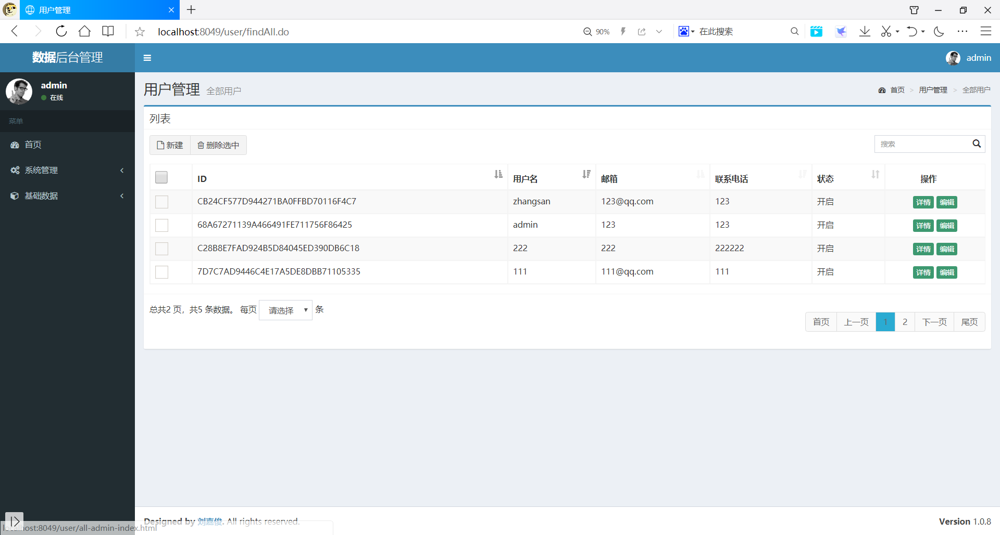

# 简介
这个项目是一个简单的企业权限管理系统，可以通过给用户赋予角色，给角色赋予权限，来实现权限的控制。

# 使用技术
IOC容器：Spring

Web框架：SpringMVC

ORM框架：Mybatis

安全框架：Spring Security

分页插件：PageHelper

数据源：C3P0

日志：log4j

后台管理框架：AdminLTE2

# 在线预览
[http://23188i98c9.51mypc.cn:12808](http://23188i98c9.51mypc.cn:12808)
* 登录账户
  * 管理员账户：admin
  * 普通账户：zhangsan
  * 密码均为：123

# 快速上手
### 1、运行环境和所需工具
* 编译器：IntelliJ IDEA
* 项目构建工具：Maven
* 数据库：Oracle
* JDK版本：jdk1.8
* Tomcat版本：Tomcat8.x

### 2、初始化项目
* 在你的Oracle中，创建一个用户，并导入我提供的 .sql 文件。
* 进入src/main/resources修改db.properties配置文件,把数据库的url、username和password改为你本地的。
* 使用 IntelliJ IDEA 导入项目，选择Maven项目选项，一路点击next就行。
* 在 IntelliJ IDEA 中，配置我们的 Tomcat， 然后把使用Maven构建好的项目添加到Tomcat中。
* 运行

# 功能模块介绍
### 1、登录模块功能
使用Spring Security权限管理框架，实现登录验证和权限信息的储存，当用户没有登陆的时候，访问其他页面会自动跳转到登录页面。
### 2、用户管理模块
可以对用户进行添加、删除、修改，以及能够查看用户详情。
* 用户列表：使用PageHelper分页插件对数据进行分页，还可以动态改变每页显示条数。

* 用户添加：添加用户时，需要对用户进行角色的赋予。填写名称时，会发送异步请求，查看该名称是否存在，若已存在，会给出提示。

* 用户删除：可以进行单个删除或者批量删除，删除的时候，会弹出确认按钮，防止误触。

* 用户信息修改：会将原来的信息展示出来。其中密码采用BCrypt加密，所以在修改的时候，需要先知道密码是否被修改，如果密码被修改了，则需要对修改后的密码进行加密；如果密码没被修改，则不需要加密。

* 用户详情：可以查看用户的角色、权限信息。

### 3、角色管理模块
角色管理模块功能与用户管理模块相似，其中添加角色的时候，可以对角色授权

### 4、资源权限管理模块

### 5、访问日志模块
* 日志列表：由于日志页数较多，所以当页数超过10页时，页数的显示参照百度搜索的分页的页数显示

* 日志搜索：可以根据访问用户的名称进行模糊查找。

### 6、产品管理模块
可以对产品进行增删改查的操作。
* 产品添加：

* 产品搜索：可以根据产品名称进行模糊查找。

### 7、订单管理模块
可以对订单进行增删改查的操作。
* 订单列表：

* 订单添加：

* 订单详情：
